<h1 align="center">Hi, I'm Faten 👋</h1>
<h3 align="center">Backend Developer (Laravel) → shifting Full-Stack</h3>

- 🔭 I'm currently **refactoring the backend of an E-commerce platform** — clean architecture, SOLID, Stripe payment workflow, order tracking, invoice emails
- 🌱 I'm currently learning **React, PHP Core, SOLID, Clean Architecture, and RAG**
- 👯 I'm looking to collaborate on **open-source Database / Laravel framework** projects
- 💵 I'm looking for **freelance work** on ERP, SaaS, and E-commerce projects
- 🤝 I'm looking for a **Junior Backend Developer** or **Full-Stack Intern** position
- 💬 Ask me about **Laravel, API Integration, Payment Gateway Integration, OOP, SQL**
- 📫 Reach me: **fatenellboudyx@gmail.com** · [LinkedIn](https://www.linkedin.com/in/faten-farag-013220235/)

 

### 🛠️ Tech Stack

 

### 📊 GitHub Stats

 

 

  
  

